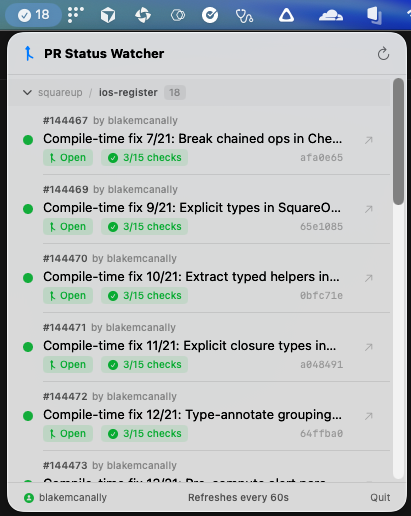

# PR Status Watcher

A lightweight macOS menu bar app that automatically tracks all of your open GitHub pull requests. See CI status, merge queue position, draft state, and more -- without ever leaving your desktop.



## What it does

- **Auto-discovers** all of your open, draft, and queued PRs -- no manual setup
- **Groups by repo** with collapsible sections
- **CI status** at a glance -- pass/fail counts and colored status dots
- **Merge queue detection** -- see which PRs are actually queued vs just open
- **Click to open** any PR directly in your browser
- **Auto-refreshes** every 60 seconds via fast GraphQL calls
- Lives entirely in the menu bar -- no Dock icon, no windows

## Menu Bar Icon

| Icon | Meaning |
|------|---------|
| Pull arrow | No open PRs |
| Green checkmark (filled) | All checks passing |
| Green checkmark (outline) | All PRs merged/closed |
| Orange clock | Some checks still running |
| Red X | One or more checks failing |

## Prerequisites

1. **macOS 13 (Ventura)** or later
2. **Xcode Command Line Tools**
   ```bash
   xcode-select --install
   ```
3. **GitHub CLI (`gh`)** -- installed and authenticated
   ```bash
   # Install
   brew install gh

   # Authenticate (follow the prompts)
   gh auth login
   ```
   If you work with a GitHub org that uses SSO, make sure to authorize your token for that org during login.

## Run locally

```bash
# Clone and run
git clone <your-repo-url>
cd pr-status-watcher
swift run
```

The app appears in your menu bar. Click the icon to see your PRs.

## Build as a standalone .app

```bash
./build.sh
```

Then either run it directly or install to Applications:

```bash
open ".build/release/PR Status Watcher.app"

# or
cp -r ".build/release/PR Status Watcher.app" /Applications/
```

## How it works

On launch (and every 60s), the app runs two GitHub GraphQL queries through the `gh` CLI -- one for your authored PRs and one for PRs where your review is requested -- along with their CI check status. No tokens to manage, no API keys to configure -- it piggybacks on your existing `gh auth` session.

PRs are grouped by repository and sorted by state (Open, Draft, Queued) then by PR number.

## Architecture

```
Sources/
├── App.swift             # @main entry point, MenuBarExtra setup, notification delegate
├── AuthStatusView.swift  # Shared auth status component (compact / detailed)
├── Models.swift          # PullRequest model, state & CI enums
├── GitHubService.swift   # GraphQL queries via gh CLI
├── PRManager.swift       # ViewModel -- discovery, polling, state, notifications
├── ContentView.swift     # Main UI with tabs, grouped/collapsible repo sections
├── PRRowView.swift       # Individual PR row with status badges
└── SettingsView.swift    # Settings (auth, launch at login, polling interval)
```

- **SwiftUI** with `MenuBarExtra` (macOS 13+)
- **GitHub GraphQL API** via `gh api graphql` -- two calls per refresh (authored + reviews)
- **Swift concurrency** (async/await, TaskGroup)
- Zero third-party dependencies

## Future Improvements

### Code Correctness

- [ ] **Harden `gh auth status` parsing** -- Replace the current string-matching against `gh auth status --active` human-readable output ("Logged in to github.com account USERNAME") with structured output via `gh api user --jq .login`. The current approach is fragile and one `gh` CLI version change away from breaking.
- [ ] **Store and cancel the polling task** -- `PRManager.startPolling()` fires a `Task` that is never stored or cancelled. Add a `pollingTask` property and cancel it in `deinit` to prevent zombie polling loops if `PRManager` is ever recreated.
- [ ] **Escape GraphQL query parameters** -- The search query string is interpolated directly into the GraphQL query via `"\(searchQuery)"`. If a username or search term contains `"` or `\`, the query silently breaks. Add a helper to escape special characters before interpolation.
- [ ] **Handle StatusContext nodes in check parsing** -- The GraphQL query only includes a `... on CheckRun` fragment. Repos using commit statuses (not check runs) produce empty nodes that are silently skipped, causing `totalCount` to be higher than the sum of passed+failed+pending.

### Code Quality

- [ ] **Remove dead error cases** -- `GHError.notAuthenticated` and `GHError.notFound` are defined but never thrown. Dead code in an error enum is confusing because it implies handling paths that don't exist.
- [ ] **Remove `statusColor` passthrough in PRRowView** -- `private var statusColor` on line 101 of `PRRowView.swift` is a one-liner alias for `pullRequest.statusColor`. Inline it at the single call site.
- [ ] **Remove redundant sorting in PRManager** -- `refreshAll()` sorts PRs by repo+number, but `ContentView.groupedPRs` re-sorts by priority+number. The PRManager sort is wasted work.
- [ ] **Replace `AnyView` with `@ViewBuilder` in badgePill** -- The `trailing` parameter uses `AnyView` type erasure, which defeats SwiftUI's view diffing optimizer. Use a generic `@ViewBuilder` closure or a concrete `Image` parameter instead.
- [ ] **Add `Codable` conformance to PullRequest** -- Enables future persistence, caching, and export without a model rewrite.
- [ ] **Add `Equatable` conformance to PullRequest** -- Improves SwiftUI diffing efficiency and enables proper change detection beyond `Identifiable`.
- [ ] **Surface notification unavailability** -- When running via `swift run` (no bundle identifier), notifications are silently disabled. Show feedback so the user knows why notifications aren't working.
- [ ] **Handle `SMAppService.register()` failures** -- The launch-at-login toggle in `SettingsView` silently swallows errors with `try?`. If registration fails (e.g., app not codesigned), the toggle appears to flip but nothing happens.

### Testing

- [ ] **Add a test target and parsing tests** -- Zero tests exist today. Add a test target to `Package.swift` and write unit tests for `parsePRNode`, `parseCheckStatus`, `tallyCheckContexts`, and `resolveOverallStatus` using mock JSON dictionaries. Cover success, failure, pending, mixed, empty, and malformed inputs.

### UX / Accessibility

- [ ] **Add keyboard shortcuts** -- `Cmd+R` for refresh, `Cmd+,` for settings, `Cmd+Q` for quit. These are standard macOS conventions and require only one-line `.keyboardShortcut()` additions to existing buttons.
- [ ] **Persist collapsed repo state** -- `collapsedRepos` is `@State` and resets every time the menu bar window opens. Persist it to `UserDefaults`.
- [ ] **Add accessibility labels** -- No `accessibilityLabel`, `accessibilityHint`, or other accessibility modifiers exist anywhere in the codebase beyond the menu bar icon image.
- [ ] **Adaptive window sizing** -- `ContentView` and `SettingsView` use hardcoded frame sizes that don't adapt to Dynamic Type, accessibility settings, or content amount.

## License

MIT
