# Research: Architecture & Design Patterns

**Date**: 2026-02-11T04:20:19Z
**Researcher**: Blake McAnally
**Git Commit**: ee7cc1b058a6848c2477fcd4b71b2a0618a95f02
**Branch**: main
**Repository**: blakemcanally/pr-status-watcher

## Research Question

Document the full architecture of the PR Status Watcher codebase, including component relationships, data flow, and the design patterns that are implemented.

## Summary

PR Status Watcher is a macOS menu bar application built with SwiftUI's `MenuBarExtra` API (macOS 13+). It uses a clean MVVM architecture with a service layer, zero third-party runtime dependencies, and communicates with GitHub's GraphQL API exclusively through the `gh` CLI as a subprocess. The codebase is 8 source files totaling ~900 lines of Swift.

The architecture follows four logical layers: **App Shell** (lifecycle, scene graph), **Presentation** (SwiftUI views), **Business Logic** (ViewModel with polling and notifications), and **Data** (CLI-based GitHub API facade). A rich domain model (`PullRequest` struct with nested enums) serves as the single shared data type across all layers.

---

## Architecture Overview

### Layer Diagram

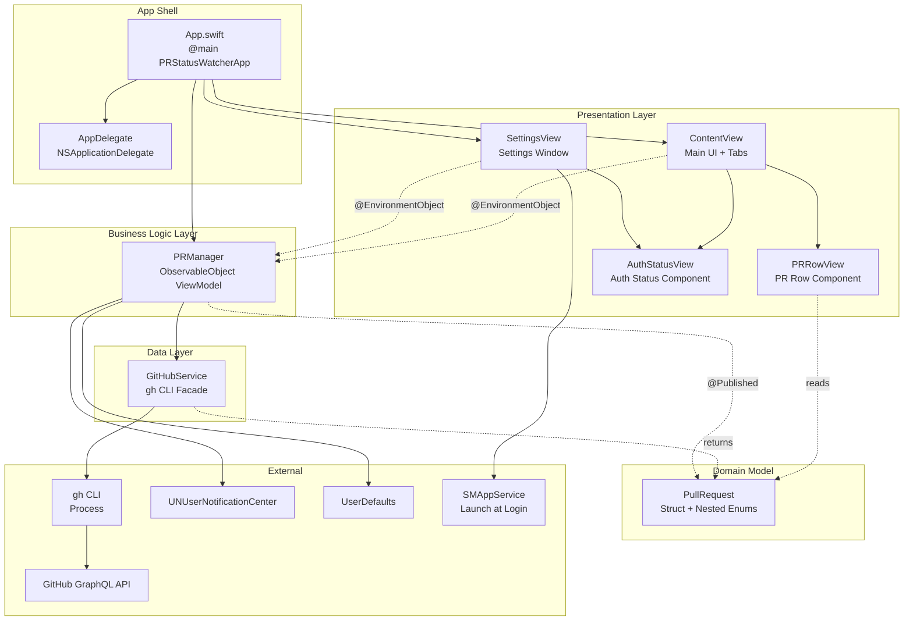

### File Map

| File | Lines | Layer | Responsibility |
|------|-------|-------|----------------|
| `App.swift` | 54 | App Shell | `@main` entry point, `MenuBarExtra` + `Window` scene graph, `AppDelegate` for Dock hiding and notification click handling |
| `Models.swift` | 117 | Domain Model | `PullRequest` struct, nested enums (`PRState`, `CIStatus`, `ReviewDecision`, `MergeableState`), `CheckInfo` struct, computed properties (`statusColor`, `sortPriority`, `reviewSortPriority`) |
| `PRManager.swift` | 291 | Business Logic | `@MainActor ObservableObject` ViewModel: published state, parallel data fetching, polling loop, diff-based notification dispatch, menu bar icon/badge computation |
| `GitHubService.swift` | 373 | Data | GitHub API facade via `gh` CLI subprocess: GraphQL query construction, JSON parsing pipeline, `gh` binary resolution, error types |
| `ContentView.swift` | 283 | Presentation | Tab-based main UI (`My PRs` / `Reviews`), grouped/collapsible repo sections, header with refresh, footer with auth/error/interval display |
| `PRRowView.swift` | 236 | Presentation | Individual PR row: status dot, title/author, badge pill system (state, CI, review, conflict), expandable failed checks |
| `SettingsView.swift` | 71 | Presentation | Settings window: auth status, launch-at-login toggle, polling interval radio group |
| `AuthStatusView.swift` | 81 | Presentation | Shared auth status component with `.compact` / `.detailed` style modes |

---

## Component Dependency Graph

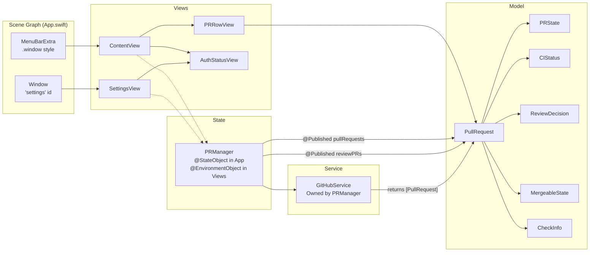

---

## Data Flow

### Refresh Cycle

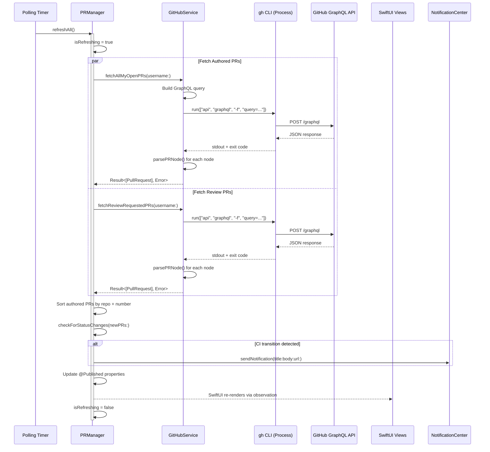

### Initialization Sequence

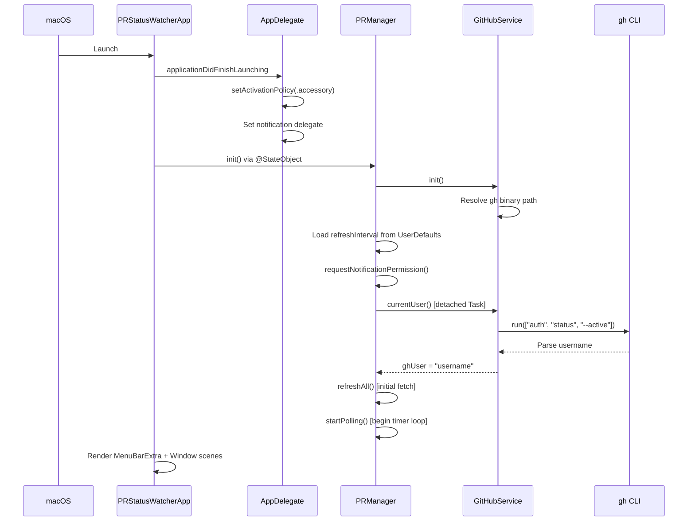

---

## State Machines

### PR State Model

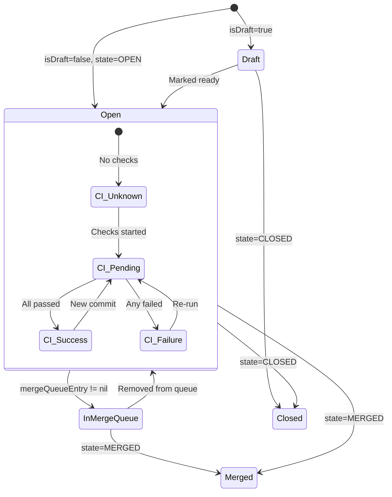

### Menu Bar Icon State

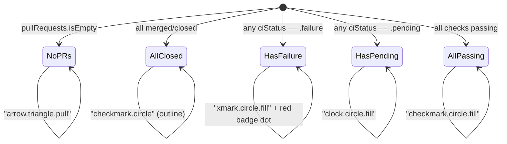

### Notification Trigger State

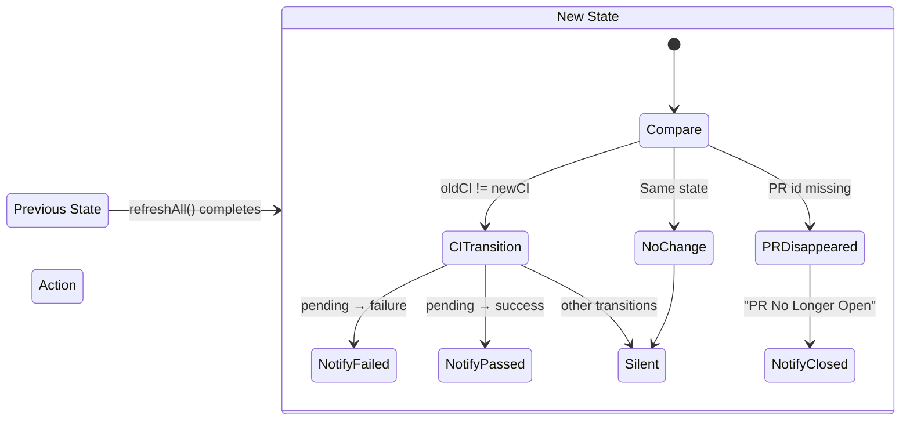

---

## View Hierarchy

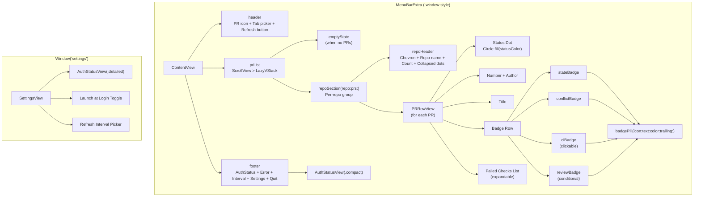

---

## Design Patterns

### 1. MVVM (Model-View-ViewModel)

The primary architectural pattern. The codebase implements a textbook SwiftUI MVVM:

- **Model**: `PullRequest` struct (`Models.swift`) — a value type with nested enums and computed properties. Holds no references to views or services.
- **ViewModel**: `PRManager` (`PRManager.swift`) — an `@MainActor ObservableObject` that owns the `GitHubService`, manages `@Published` state arrays, handles polling, and computes derived display properties (menu bar icon, status summary).
- **Views**: `ContentView`, `PRRowView`, `SettingsView`, `AuthStatusView` — pure SwiftUI views that read from the ViewModel via `@EnvironmentObject` and trigger actions (refresh, open URL, change settings).

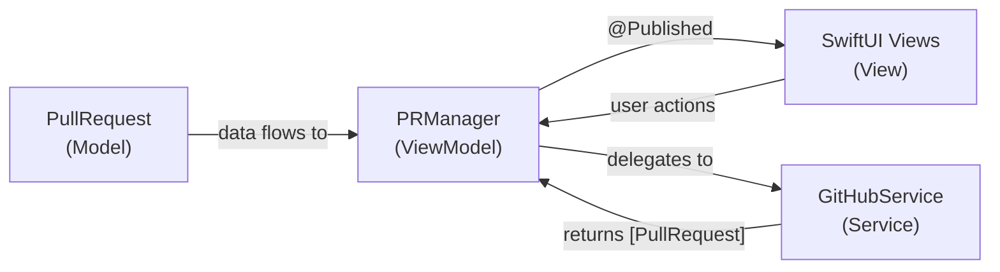

**Key locations**:
- `PRManager.swift:8-14` — `@Published` property declarations
- `App.swift:31` — `@StateObject private var manager = PRManager()`
- `ContentView.swift:9` — `@EnvironmentObject var manager: PRManager`
- `App.swift:36-37` — `.environmentObject(manager)` injection

### 2. Service Layer / Facade Pattern

`GitHubService` acts as a facade that hides the complexity of:
- Resolving the `gh` binary path across install locations
- Constructing GraphQL queries as string templates
- Managing `Process` subprocesses with pipes
- Parsing nested JSON dictionaries into `PullRequest` models

The rest of the app never touches `Process`, `JSONSerialization`, or GraphQL — it only sees `fetchAllMyOpenPRs(username:) throws -> [PullRequest]`.

**Key locations**:
- `GitHubService.swift:5-18` — Binary resolution at init
- `GitHubService.swift:53-116` — `fetchPRs(searchQuery:)` shared fetch pipeline
- `GitHubService.swift:325-345` — `run(_:)` subprocess wrapper

### 3. Rich Domain Model

`PullRequest` is a value type (struct) that carries its own display logic as computed properties rather than pushing that logic into views:

| Property | Purpose | Location |
|----------|---------|----------|
| `statusColor` | Canonical color for status dots and collapsed summary | `Models.swift:55-69` |
| `sortPriority` | Sort ordering: Open(0), Draft(1), Queued(2), Closed/Merged(3) | `Models.swift:34-42` |
| `reviewSortPriority` | Sort ordering for the Reviews tab | `Models.swift:46-52` |
| `CIStatus.color` | CI status to color mapping | `Models.swift:86-93` |

The nested enums (`PRState`, `CIStatus`, `ReviewDecision`, `MergeableState`) model discrete state spaces as proper types rather than raw strings, with the `GitHubService` parsing layer converting GitHub's string constants to enum values.

### 4. Observer Pattern (via Combine/SwiftUI)

SwiftUI's observation system implements the Observer pattern:

- `PRManager` declares `@Published` properties (`pullRequests`, `reviewPRs`, `isRefreshing`, `lastError`, `ghUser`, `refreshInterval`)
- Views automatically subscribe to changes via `@EnvironmentObject`
- When `PRManager` updates any `@Published` property, all observing views re-render

This is not hand-rolled — it leverages SwiftUI's built-in `ObservableObject` / `@Published` / `@EnvironmentObject` infrastructure.

### 5. Environment-Based Dependency Injection

The `PRManager` instance is created once at the `App` level and injected down the view hierarchy using SwiftUI's environment:

```
PRStatusWatcherApp (@StateObject PRManager)
├── MenuBarExtra → ContentView (@EnvironmentObject PRManager)
│   ├── PRRowView (receives PullRequest directly)
│   └── AuthStatusView (receives username directly)
└── Window → SettingsView (@EnvironmentObject PRManager)
    └── AuthStatusView (receives username directly)
```

Leaf views (`PRRowView`, `AuthStatusView`) receive only the data they need as init parameters rather than the full ViewModel, reducing coupling.

### 6. Polling Pattern with Diff-Based Notifications

`PRManager` implements a polling loop using `Task.sleep` in an infinite `while !Task.isCancelled` loop. On each cycle, it:

1. Fetches fresh data from GitHub (two parallel API calls)
2. Compares new state against stored `previousCIStates` and `previousPRIds`
3. Sends macOS notifications for specific transitions:
   - `pending → failure` → "CI Failed"
   - `pending → success` → "All Checks Passed"
   - PR disappears from results → "PR No Longer Open"
4. Updates the stored previous state for the next diff

This is a classic **polling + state diffing** pattern. The first load is skipped (`isFirstLoad` flag) to avoid a burst of notifications on app launch.

**Key locations**:
- `PRManager.swift:213-220` — `startPolling()` loop
- `PRManager.swift:233-271` — `checkForStatusChanges(newPRs:)` diff logic
- `PRManager.swift:30-32` — Previous state storage

### 7. Parallel Async Data Fetching

`refreshAll()` uses Swift's `async let` to fetch authored PRs and review-requested PRs concurrently:

```swift
async let myResult = Task.detached { svc.fetchAllMyOpenPRs(username:) }.value
async let reviewResult = Task.detached { svc.fetchReviewRequestedPRs(username:) }.value
let (myPRs, revPRs) = await (myResult, reviewResult)
```

The `Task.detached` wrappers move the synchronous `gh` CLI calls off the main actor, keeping the UI responsive during network fetches.

**Key location**: `PRManager.swift:141-209`

### 8. Reusable View Component with Style Enum

`AuthStatusView` demonstrates a pattern for creating a single component that renders differently based on context:

```swift
struct AuthStatusView: View {
    let username: String?
    let style: Style

    enum Style {
        case compact   // footer: icon + username
        case detailed  // settings: full card with instructions
    }
}
```

This avoids duplicating auth status rendering across `ContentView` (footer) and `SettingsView`, while allowing each context to specify the appropriate visual treatment.

**Key locations**:
- `AuthStatusView.swift:3-81` — Full implementation
- `ContentView.swift:242` — `.compact` usage
- `SettingsView.swift:29` — `.detailed` usage

### 9. Badge Pill System (Compositional View Pattern)

`PRRowView` defines a `badgePill(icon:text:color:trailing:)` helper that creates a uniform badge appearance. All badge types compose through this single function:

| Badge | Usage |
|-------|-------|
| `stateBadge` | `badgePill(icon: stateIcon, text: stateText, color: statusColor)` |
| `conflictBadge` | `badgePill(icon: "...", text: "Conflicts", color: .red)` |
| `ciBadge` | `badgePill(icon: ciIcon, text: ciText, color: ciStatus.color, trailing: chevron)` |
| `reviewBadge` | `badgePill(icon: "...", text: "Approved"/"Changes"/"Review", color: ...)` |

The `trailing` parameter accepts an optional closure for badges that need extra content (the CI badge's expand/collapse chevron).

**Key location**: `PRRowView.swift:216-234`

### 10. App Delegate Bridge

The app uses `@NSApplicationDelegateAdaptor` to bridge UIKit/AppKit patterns into SwiftUI:

- `setActivationPolicy(.accessory)` — hides the app from the Dock (menu-bar-only)
- `UNUserNotificationCenterDelegate` — handles notification click events to open PR URLs in the browser

This is the standard pattern for macOS menu bar apps that need lifecycle hooks not yet available in pure SwiftUI.

**Key location**: `App.swift:6-24`

### 11. UserDefaults Persistence with Property Observer

The polling interval is persisted using a `didSet` observer on the `@Published` property:

```swift
@Published var refreshInterval: Int {
    didSet { UserDefaults.standard.set(refreshInterval, forKey: Self.pollingKey) }
}
```

On init, the value is loaded from UserDefaults with a fallback default of 60 seconds. This is a lightweight persistence pattern that avoids a full data layer for single-value settings.

**Key locations**:
- `PRManager.swift:18-19` — Property with didSet
- `PRManager.swift:37-38` — Load on init

### 12. Collapsible Section with Local State

`ContentView` tracks collapsed repos in a `@State` `Set<String>`:

```swift
@State private var collapsedRepos: Set<String> = []
```

Repo headers toggle membership in this set, and the view conditionally renders PR rows based on set membership. When collapsed, a row of colored dots provides a summary. This is a common SwiftUI pattern for expandable/collapsible UI without external state management.

**Key locations**:
- `ContentView.swift:12` — State declaration
- `ContentView.swift:148-191` — `repoHeader` toggle logic
- `ContentView.swift:120-121` — Conditional row rendering

---

## Build & Deployment

### Package Structure

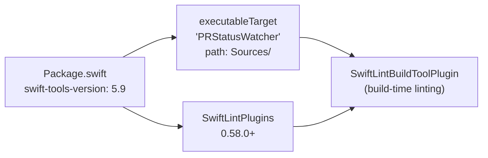

- **Platform**: macOS 13+ (Ventura)
- **Swift Tools Version**: 5.9
- **Runtime Dependencies**: Zero (only SwiftLint as a build plugin)
- **Build**: `swift build` / `swift run` for development
- **Release**: `build.sh` creates a `.app` bundle with `Info.plist` including `LSUIElement: true` (no Dock icon)

### App Bundle Creation (build.sh)

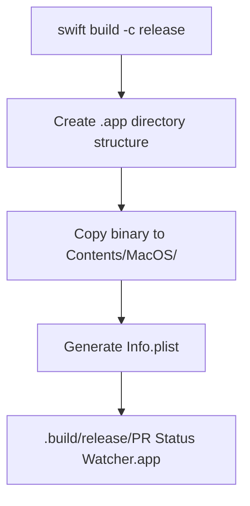

---

## Technology Inventory

| Technology | Usage | Location |
|------------|-------|----------|
| SwiftUI `MenuBarExtra` | Menu bar window with `.window` style | `App.swift:34-44` |
| SwiftUI `Window` | Settings window with id-based `openWindow` | `App.swift:46-51` |
| `@NSApplicationDelegateAdaptor` | AppKit lifecycle bridge | `App.swift:30` |
| `ObservableObject` / `@Published` | Reactive state management | `PRManager.swift:8-14` |
| `@EnvironmentObject` | Dependency injection | `ContentView.swift:9`, `SettingsView.swift:5` |
| `@StateObject` | Owned observable creation | `App.swift:31` |
| Swift Concurrency (`async/await`) | Parallel fetching, detached tasks | `PRManager.swift:141-209` |
| `Process` (Foundation) | `gh` CLI subprocess execution | `GitHubService.swift:325-345` |
| `JSONSerialization` | Manual JSON parsing (no Codable) | `GitHubService.swift:104-111` |
| `UNUserNotificationCenter` | macOS notifications | `PRManager.swift:273-289` |
| `UserDefaults` | Polling interval persistence | `PRManager.swift:16-19` |
| `SMAppService` | Launch at login | `SettingsView.swift:6, 40-44` |
| `NSWorkspace.shared.open` | Open URLs in default browser | `PRRowView.swift:9`, `App.swift:20` |
| `NSPasteboard` | Copy to clipboard | `ContentView.swift:128-133` |
| SwiftLint (build plugin) | Lint enforcement at compile time | `Package.swift:14` |

---

## Code References

- `Sources/App.swift:1-54` — App entry point, scene graph, delegate
- `Sources/Models.swift:1-117` — Domain model with nested enums
- `Sources/PRManager.swift:1-291` — ViewModel: state, polling, notifications, menu bar
- `Sources/GitHubService.swift:1-373` — GitHub API facade, GraphQL, parsing
- `Sources/ContentView.swift:1-283` — Main UI with tabs and grouped sections
- `Sources/PRRowView.swift:1-236` — PR row component with badge system
- `Sources/SettingsView.swift:1-71` — Settings window
- `Sources/AuthStatusView.swift:1-81` — Shared auth status component
- `Package.swift:1-19` — SPM manifest, zero runtime deps
- `build.sh:1-58` — App bundle builder
- `.swiftlint.yml:1-57` — Lint configuration

## Related Research

- `thoughts/shared/research/2026-02-10-dry-refactoring-opportunities.md` — DRY analysis and duplication findings
- `thoughts/shared/plans/2026-02-10-dry-cleanup.md` — Implementation plan for DRY refactoring
