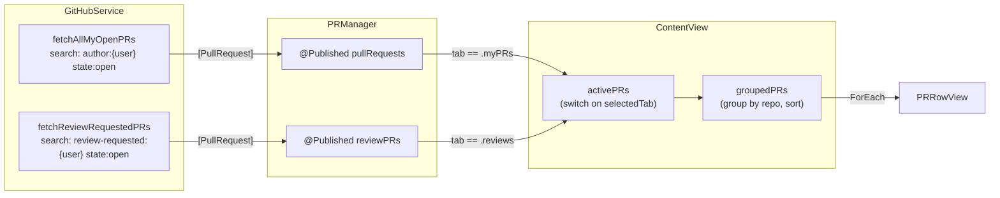
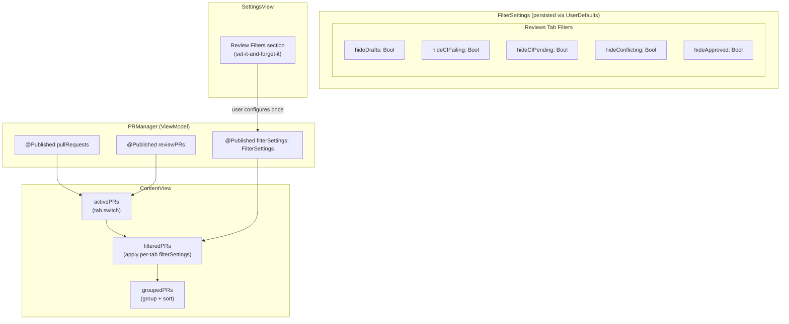
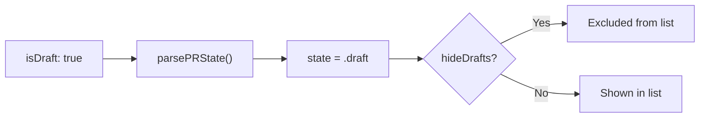
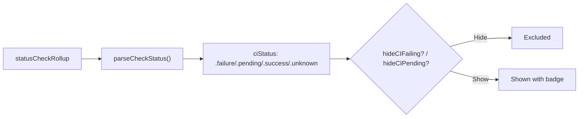
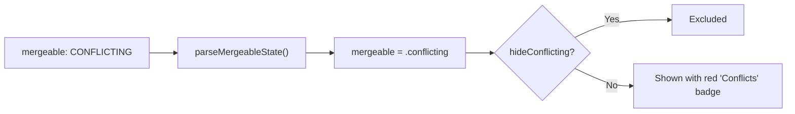
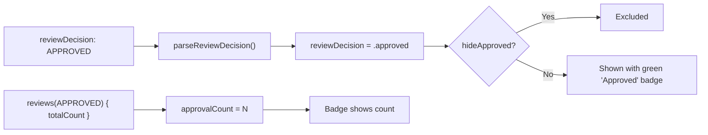
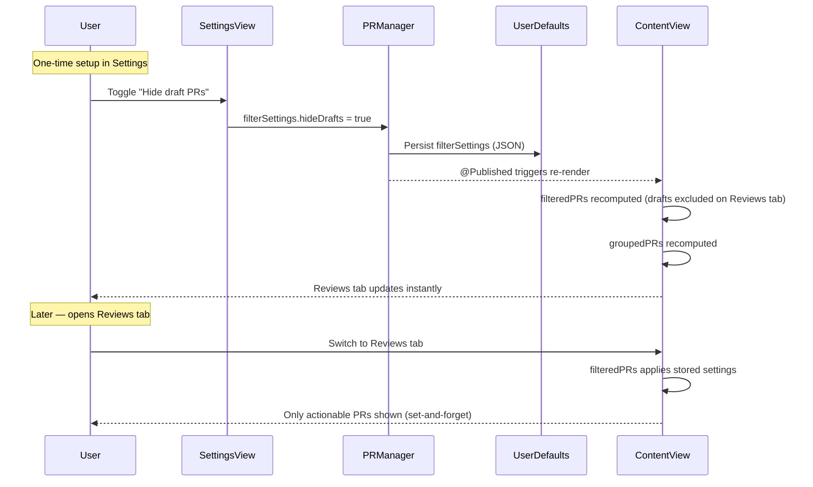

# Research: Reviewability Filter Controls

**Date**: 2026-02-11T04:39:28Z
**Researcher**: Blake McAnally
**Git Commit**: fc1774be52214355ec40d27776358a04fb1953a0
**Branch**: main
**Repository**: blakemcanally/pr-status-watcher

## Research Question

Where in the codebase could we implement controls for when a PR shows up as "reviewable" in the list? Investigate hiding PRs based on: draft status, failed status checks, merge conflicts, and sufficient reviews. Also explore showing merged PRs that the user didn't review for audit purposes.

## Summary

The codebase already fetches **all four** data signals needed for the core filtering use cases (draft status, CI status, merge conflicts, review decision). No new GraphQL fields or API calls are needed for the basic filters — only a filtering layer in `PRManager` or `ContentView` plus user preferences in `SettingsView`. The merged-PR audit feature requires a **new GraphQL query**, a **model extension** (`mergedAt`, per-reviewer review data), and a **new UI tab or section**.

The architecture is well-suited for this: the MVVM pattern means filter state can live as `@Published` properties on `PRManager` (persisted via UserDefaults), with `ContentView` consuming a filtered/computed view of the PR arrays. The existing `activePRs` computed property in `ContentView` is the natural interception point.

---

## Data Availability Matrix

This table maps each filter to the data that's currently fetched, what's missing, and the implementation complexity.

| Filter | Data Field | Currently Fetched? | GraphQL Field | Complexity |
|--------|-----------|-------------------|---------------|------------|
| Hide Draft PRs | `state == .draft` | Yes | `isDraft` | Trivial |
| Hide CI-failing PRs | `ciStatus == .failure` | Yes | `statusCheckRollup` | Trivial |
| Hide CI-pending PRs | `ciStatus == .pending` | Yes | `statusCheckRollup` | Trivial |
| Hide conflicting PRs | `mergeable == .conflicting` | Yes | `mergeable` | Trivial |
| Hide sufficiently-reviewed PRs | `reviewDecision == .approved` | Yes | `reviewDecision` | Trivial |
| Hide by approval count threshold | `approvalCount` vs threshold | Partial — count available, threshold not | `branchProtectionRules` (admin) | Medium |
| Hide by required check names | Check names vs required list | Not fetched | `branchProtectionRules` (admin) | Medium |
| Hide by label (e.g., "WIP") | Not fetched | No | `labels(first:) { nodes { name } }` | Low |
| Merged PR audit | Not fetched | No | New search query + `mergedAt` + `reviews` | High |

---

## Current Data Flow

The following diagram shows how PR data currently flows from API to UI, with **no filtering layer** between fetch and display:



**Key observation**: There is no filtering step between `@Published` arrays and `activePRs`. The `activePRs` computed property in `ContentView:14-19` is a simple tab switch. The `groupedPRs` computed property at `ContentView:22-42` only groups and sorts.

---

## Proposed Filter Architecture



### FilterSettings struct

A `Codable` value type encapsulating per-tab filter preferences, persisted as a single JSON blob in UserDefaults:

```swift
struct FilterSettings: Codable, Equatable {
    // Reviews tab: hide PRs that aren't actionable for review
    var hideDrafts: Bool = true          // on by default — drafts aren't reviewable
    var hideCIFailing: Bool = false
    var hideCIPending: Bool = false
    var hideConflicting: Bool = false
    var hideApproved: Bool = false

    // My PRs tab: no filters by default (at-a-glance dashboard)
    // Reserved for future per-tab expansion
}
```

Filters only apply to the Reviews tab. My PRs is a personal at-a-glance view — it shows everything. This is enforced in the filter predicate, not in the settings UI (the settings UI only shows "Review Filters").

### Where the filter predicate applies

The filter is a computed property on `ContentView` between `activePRs` and `groupedPRs`:

```swift
// ContentView.swift — new computed property
private var filteredPRs: [PullRequest] {
    guard selectedTab == .reviews else { return activePRs }

    let settings = manager.filterSettings
    return activePRs.filter { pr in
        if settings.hideDrafts && pr.state == .draft { return false }
        if settings.hideCIFailing && pr.ciStatus == .failure { return false }
        if settings.hideCIPending && pr.ciStatus == .pending { return false }
        if settings.hideConflicting && pr.mergeable == .conflicting { return false }
        if settings.hideApproved && pr.reviewDecision == .approved { return false }
        return true
    }
}
```

Then `groupedPRs` consumes `filteredPRs` instead of `activePRs`. Menu bar counts (`openCount`, `draftCount`, etc.) also switch to the filtered arrays.

---

## Detailed Analysis: Each Filter

### 1. Hide Draft PRs

**Signal**: `PullRequest.state == .draft`
**Source**: `GitHubService.parsePRState(rawState:isDraft:)` at `GitHubService.swift:196-201`



**Current display**: Draft PRs appear in the Reviews tab with a gray "Draft" badge pill (`PRRowView.swift:117` → `stateText` returns "Draft").

**Implementation**:
- **Data changes**: None
- **Filter location**: `filteredPRs` predicate — `pr.state == .draft`
- **Default**: `true` for Reviews tab (drafts are not reviewable), `false` for My PRs tab
- **UI**: Toggle in filter bar: "Hide drafts"

**Note**: This is the most impactful single filter. Draft PRs in the Reviews tab represent noise — the author hasn't marked them ready for review yet. Most users would want this on by default.

---

### 2. Hide PRs with Failing/Pending Status Checks

**Signal**: `PullRequest.ciStatus` (`.failure` / `.pending`)
**Source**: `GitHubService.parseCheckStatus(from:)` at `GitHubService.swift:212-234`



**Current display**: CI status is shown as a badge pill with pass/fail counts (`PRRowView.swift:168-192`). Failed checks are expandable.

**Implementation**:
- **Data changes**: None for basic CI filtering
- **Filter location**: `filteredPRs` predicate — `pr.ciStatus == .failure` and/or `pr.ciStatus == .pending`
- **Default**: `false` (most reviewers probably want to see failing PRs so they can comment on the failure)
- **UI**: Two separate toggles: "Hide CI-failing" and "Hide CI-pending", or a single "Only show CI-passing PRs"

**Repo-specific required checks** (advanced): The current `ciStatus` reflects the overall rollup of ALL checks, not just the ones required by branch protection. To filter by required checks specifically:

1. Fetch `branchProtectionRules` from the repository:
   ```graphql
   repository { branchProtectionRules(first: 10) {
     nodes { pattern, requiredStatusCheckContexts }
   }}
   ```
2. Match `PullRequest.headRefName` (base branch) against rule `pattern`
3. Check only the required contexts against the per-check results

**Caveat**: `branchProtectionRules` requires **admin access** to the repository. Without it, the query returns empty. For most users, the simple `ciStatus` filter is sufficient — GitHub's `reviewDecision` already considers required checks when determining if a PR is approved.

---

### 3. Hide PRs with Merge Conflicts

**Signal**: `PullRequest.mergeable == .conflicting`
**Source**: `GitHubService.parseMergeableState(from:)` at `GitHubService.swift:187-194`



**Current display**: Conflicting PRs show a red "Conflicts" badge (`PRRowView.swift:158-163`).

**Implementation**:
- **Data changes**: None
- **Filter location**: `filteredPRs` predicate — `pr.mergeable == .conflicting`
- **Default**: `false` (conflicts are actionable — reviewer may want to comment "please rebase")
- **UI**: Toggle: "Hide conflicting PRs"

**Note**: GitHub sometimes returns `mergeable: UNKNOWN` briefly after a push. The filter should only hide `.conflicting`, not `.unknown`.

---

### 4. Hide PRs with Sufficient Reviews

**Signal**: `PullRequest.reviewDecision == .approved`
**Source**: `GitHubService.parseReviewDecision(from:)` at `GitHubService.swift:177-185`



**Current display**: Approved PRs show a green "Approved" badge on the Reviews tab, but only when CI is passing or unknown (`PRRowView.swift:43-46`).

**Implementation**:
- **Data changes**: None for basic filtering. `reviewDecision == .approved` already respects the repository's branch protection required review count — GitHub computes this server-side.
- **Filter location**: `filteredPRs` predicate — `pr.reviewDecision == .approved`
- **Default**: `false` (some reviewers still want to pile-on review approved PRs)
- **UI**: Toggle: "Hide approved PRs"

**Advanced — custom approval threshold**: If users want to set "hide when N+ approvals" regardless of branch protection:
- Use `pr.approvalCount >= threshold`
- Add a stepper or picker for the threshold value in settings
- `approvalCount` is already fetched via `reviews(states: APPROVED, first: 0) { totalCount }`

**Fetching required approval count** (optional, requires admin):
```graphql
repository {
  branchProtectionRules(first: 10) {
    nodes {
      pattern
      requiresApprovingReviews
      requiredApprovingReviewCount
    }
  }
}
```

---

### 5. Label-Based Filtering (Bonus)

**Signal**: Not currently fetched
**GraphQL field**: `labels(first: 50) { nodes { name } }`

Some teams use labels like "WIP", "do-not-review", "blocked", or "on-hold" to signal that a PR isn't ready for review.

**Implementation**:
- **Data changes**: Add `labels: [String]` to `PullRequest` model
- **GraphQL change**: Add `labels(first: 20) { nodes { name } }` to the search query fragment
- **Parsing**: Extract label names in `parsePRNode()`
- **Filter**: `pr.labels` intersection with `settings.hideLabels` is empty
- **UI**: Text field or tag picker in settings for label names to hide
- **Complexity**: Low — labels are a simple string list

---

### 6. Merged PR Audit — Deferred

Showing merged PRs that the user didn't review for audit purposes. This requires a new GraphQL query (`is:merged merged:>{date}`), model extensions (`mergedAt`, per-reviewer review data), and a new tab or section. Deferred as a fringe use case — may revisit later.

---

## Filter Interaction Points in the Codebase

### Where filter state would be stored

| Component | File | What to add |
|-----------|------|-------------|
| `PRManager` | `PRManager.swift:8-14` | `@Published var filterSettings: FilterSettings` with `didSet` UserDefaults persistence |
| UserDefaults key | `PRManager.swift:16-17` | New key: `"filter_settings"` |
| Init | `PRManager.swift:42-56` | Load `FilterSettings` from UserDefaults on startup |

### Where filter predicates would apply

| Component | File:Lines | Current behavior | Change needed |
|-----------|-----------|-----------------|---------------|
| `ContentView.activePRs` | `ContentView.swift:14-19` | Returns full array from selected tab | Add `filteredPRs` between `activePRs` and `groupedPRs` |
| `ContentView.groupedPRs` | `ContentView.swift:22-42` | Consumes `activePRs` | Change to consume `filteredPRs` |
| `PRManager.openCount` | `PRManager.swift:80-82` | Counts all open PRs | Badge counts must reflect **filtered** PRs — user cares about what's actionable |

### Where filter UI would live

| Location | File | Purpose |
|----------|------|---------|
| Settings panel | `SettingsView.swift` | "Review Filters" section with toggles — set-it-and-forget-it |
| No filter bar | — | Filters are not exposed in ContentView — the dashboard is static |

---

## Filter State Flow



---

## Settings UI Concept

The filter configuration lives entirely in `SettingsView` as a new "Review Filters" section, following the existing section pattern (headline + description + controls):

```
┌─────────────────────────────────────────┐
│  PR Status Watcher                      │
│  ───────────────────────────────────     │
│  GitHub Authentication                  │
│  ✅ Signed in as bmcanally              │
│  ───────────────────────────────────     │
│  Startup                                │
│  ☐ Launch at login                      │
│  ───────────────────────────────────     │
│  Refresh Interval                       │
│  How often to check GitHub...           │
│  ○ 30 seconds  ● 1 minute  ○ 2 min     │
│  ───────────────────────────────────     │
│  Review Filters                         │
│  Hide PRs on the Reviews tab that       │
│  aren't ready for your review.          │
│                                         │
│  ☑ Hide draft PRs                       │
│  ☐ Hide PRs with failing CI             │
│  ☐ Hide PRs with pending CI             │
│  ☐ Hide PRs with merge conflicts        │
│  ☐ Hide already-approved PRs            │
│                                         │
└─────────────────────────────────────────┘
```

This matches the "set it and forget it" philosophy — configure once, then the Reviews tab always shows only actionable PRs. The My PRs tab is unaffected.

---

## Implementation Priority

| # | Feature | Data Ready? | Effort | User Value | Recommended Phase |
|---|---------|------------|--------|------------|-------------------|
| 1 | `FilterSettings` model + UserDefaults persistence | N/A | Low | Foundation | Phase 1 |
| 2 | Per-tab filter defaults (Reviews vs My PRs) | N/A | Low | High | Phase 1 |
| 3 | Hide drafts (Reviews tab) | Yes | Trivial | High | Phase 1 |
| 4 | Hide conflicting PRs | Yes | Trivial | Medium | Phase 1 |
| 5 | Hide approved PRs | Yes | Trivial | Medium | Phase 1 |
| 6 | Hide CI-failing PRs | Yes | Trivial | Medium | Phase 1 |
| 7 | Hide CI-pending PRs | Yes | Trivial | Low | Phase 1 |
| 8 | Filtering section in SettingsView | N/A | Low | High | Phase 1 |
| 9 | Menu bar counts use filtered PRs | N/A | Low | Medium | Phase 1 |
| 10 | Label-based filtering | Needs fetch | Low | Medium | Phase 2 |
| ~~11~~ | ~~Merged PR audit tab~~ | ~~Needs new query~~ | ~~High~~ | ~~—~~ | Deferred |
| ~~12~~ | ~~Repo-specific required checks~~ | ~~Needs admin~~ | ~~Medium~~ | ~~—~~ | Deferred |

---

## Code References

### Data model (already has all filter signals)
- `Sources/Models.swift:14` — `state: PRState` (includes `.draft`)
- `Sources/Models.swift:15` — `ciStatus: CIStatus`
- `Sources/Models.swift:25` — `mergeable: MergeableState`
- `Sources/Models.swift:24` — `reviewDecision: ReviewDecision`
- `Sources/Models.swift:27` — `approvalCount: Int`
- `Sources/Models.swift:73-78` — `PRState` enum (`.open`, `.closed`, `.merged`, `.draft`)
- `Sources/Models.swift:80-94` — `CIStatus` enum with `.color` computed property
- `Sources/Models.swift:105-109` — `MergeableState` enum (`.mergeable`, `.conflicting`, `.unknown`)
- `Sources/Models.swift:98-103` — `ReviewDecision` enum

### GraphQL data fetching
- `Sources/GitHubService.swift:31-32` — `fetchAllMyOpenPRs` (search query: `author:{user} state:open`)
- `Sources/GitHubService.swift:36-37` — `fetchReviewRequestedPRs` (search query: `review-requested:{user} state:open`)
- `Sources/GitHubService.swift:52-99` — GraphQL query with `isDraft`, `reviewDecision`, `mergeable`, `statusCheckRollup`
- `Sources/GitHubService.swift:123-175` — `parsePRNode()` — parses all fields
- `Sources/GitHubService.swift:139` — `isDraft` parsing
- `Sources/GitHubService.swift:148-151` — `reviewDecision`, `mergeable`, `state`, check status parsing

### Where filtering would be inserted
- `Sources/ContentView.swift:14-19` — `activePRs` (tab switch, no filtering)
- `Sources/ContentView.swift:22-42` — `groupedPRs` (group + sort, would consume `filteredPRs`)
- `Sources/ContentView.swift:98-114` — `prList` (renders `groupedPRs`)

### Where filter preferences would be stored
- `Sources/PRManager.swift:9-13` — Existing `@Published` properties (add `filterSettings` here)
- `Sources/PRManager.swift:16-17` — Existing UserDefaults keys (add `"filter_settings"` key)
- `Sources/PRManager.swift:42-45` — Init loads from UserDefaults (add filter loading)

### Where filter UI would go
- `Sources/ContentView.swift:44-56` — `body` (insert filter bar between `header` and `prList`)
- `Sources/SettingsView.swift:64-80` — Polling section (add filter settings section after)

### Visual pattern to reuse for filter pills
- `Sources/PRRowView.swift:216-242` — `badgePill` helper (reusable for filter toggle pills)

---

## GitHub GraphQL API Notes

### Fields already in the query
| Field | GraphQL Path | Model Property |
|-------|-------------|----------------|
| Draft status | `isDraft` | `state == .draft` |
| CI rollup | `commits(last:1) { nodes { commit { statusCheckRollup { state, contexts } } } }` | `ciStatus` |
| Mergeability | `mergeable` | `mergeable` |
| Review decision | `reviewDecision` | `reviewDecision` |
| Approval count | `reviews(states: APPROVED, first: 0) { totalCount }` | `approvalCount` |

### Fields to add for label filtering (Phase 2)
```graphql
labels(first: 20) {
  nodes {
    name
  }
}
```

### Deferred: Merged audit query and branch protection rules

Both require new GraphQL queries and are out of scope for the initial implementation. See "Merged PR Audit — Deferred" and "Branch protection" notes earlier in this document. The merged audit query would use `is:merged merged:>{date}` with `reviews` and `mergedAt` fields. Branch protection rules require admin access (`branchProtectionRules` on `Repository`).

---

## Related Research

- `thoughts/shared/research/2026-02-10-architecture-and-design-patterns.md` — Full architecture documentation
- `thoughts/shared/research/2026-02-10-dry-refactoring-opportunities.md` — DRY analysis
- `thoughts/shared/plans/2026-02-10-dry-cleanup.md` — Refactoring plan (Phase 1 complete)

## Design Decisions (Resolved)

1. **Per-tab filters**: Filter settings apply per-tab. The My PRs and Reviews tabs serve different goals — Reviews filters are about hiding unactionable review requests; My PRs is a personal at-a-glance dashboard. Each tab gets its own filter configuration.
2. **Settings-only configuration**: Filters are configured exclusively in Settings, not via an inline filter bar. The experience is "set it and forget it" — a static dashboard with rich up-front configurability, not something tweaked on every glance.
3. **Filtered counts**: Menu bar badge/count reflects the **filtered** PR counts. The user cares about what they need to act on, not the total.
4. **Merged PR audit**: Deferred — this is a fringe ask. Phases 3-4 (merged audit, branch protection rules) are dropped from the initial scope.

## Open Questions

- None at this time. All design questions resolved.
